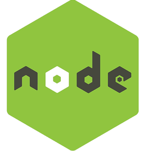

# Cep API

## To Run on Developement:

```
npm start

OR

npm run dev
```

## To build on production:

```
npm run build

Will be created a new folder 'dist'.
Next inside the dist folder run:

node server.js
```

# Docs

1. [Folder structure](docs/Folder_Structure.md)

# Tools



# Main libraries:

- express
- express-jwt
- jsonwebtoken
- jwks-rsa
